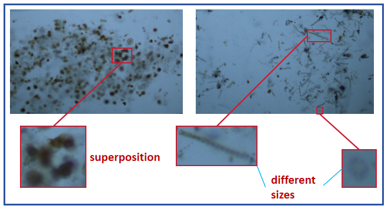
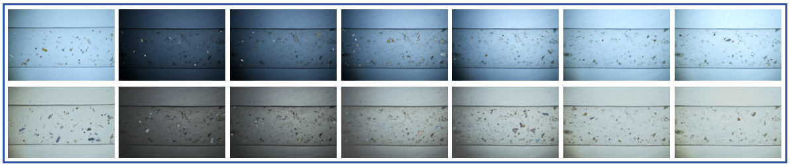
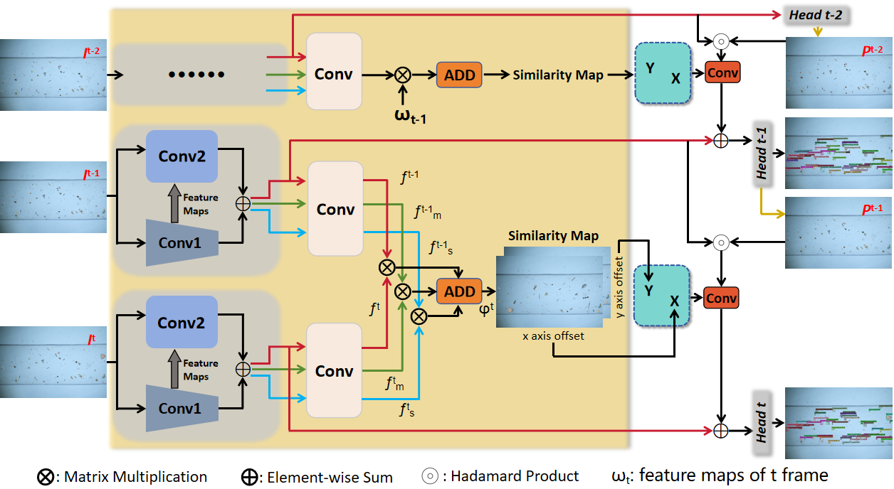
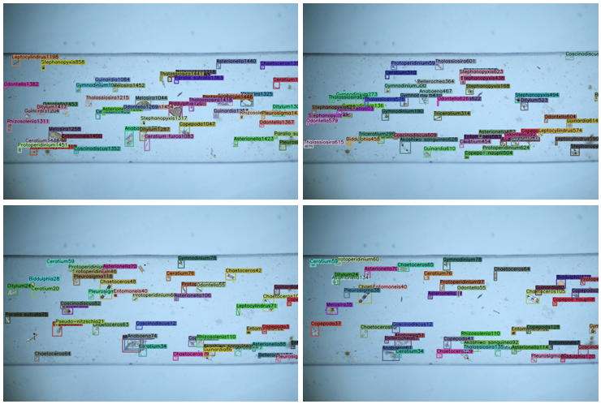

<!-- # MPT: A Large-scale Multi-Phytoplankton Tracking Benchmark -->


## MPT: A Large-scale Multi-Phytoplankton Tracking Benchmark

Yang Yu, [Yuezun Li](https://yuezunli.github.io/), Xin Sun, Junyu Dong

Ocean University of China, China

Intelligent Marine Technology and System(IMTS), 2024

*[arXiv 2410.16695](https://arxiv.org/abs/2410.16695)*

### Contents
1. [Abstract](#Abstract)
2. [Dataset Description](#Dataset-Description)
3. [Dataset Download](#Dataset-Download)
4. [Proposed Method: DSFT](#Proposed-Method:-DSFT)
5. [Installation](#Installation)
6. [Run Demo](#Run-Demo)
7. [Data preparation](#Data-preparation)
8. [Training](#Training)
9. [Citation](#Citation)
10. [Acknowledgement](#Acknowledgement)


### Abstract
Phytoplankton are a crucial component of aquatic ecosystems, and effective monitoring of them can provide valuable insights into ocean environments and ecosystem changes. Traditional phytoplankton monitoring methods are often complex and lack timely analysis. Therefore, deep learning algorithms offer a promising approach for automated phytoplankton monitoring. However, the lack of large-scale, high-quality training samples has become a major bottleneck in advancing phytoplankton tracking. In this paper, we propose a challenging benchmark dataset, Multiple Phytoplankton Tracking (MPT), which covers diverse background information and variations in motion during observation. The dataset includes 27 species of phytoplankton and zooplankton, 14 different backgrounds to simulate diverse and complex underwater environments, and a total of 140 videos. To enable accurate real-time observation of phytoplankton, we introduce a multi-object tracking method, Deviation-Corrected Multi-Scale Feature Fusion Tracker(DSFT), which addresses issues such as focus shifts during tracking and the loss of small target information when computing frame-to-frame similarity. Specifically, we introduce an additional feature extractor to predict the residuals of the standard feature extractor's output, and compute multi-scale frame-to-frame similarity based on features from different layers of the extractor. Extensive experiments on the MPT have demonstrated the validity of the dataset and the superiority of DSFT in tracking phytoplankton, providing an effective solution for phytoplankton monitoring.

<p align="center"></p>


### Dataset Description
MPT is a large-scale, high difficulty video dataset of phytoplankton. In the dataset, we have set up a detals.txt file in each video file, which stores the number of samples, total video frames, sample jitter amplitude, and sample movement speed set when creating the dataset. There are two annotation files under each video file, where gt.txt does not include occlusion factors, and the other annotation file includes occlusion parameters.

<p align="center"></p>

### Dataset Download

##### The MPT dataset can be downloaded from the following link: [[baidu(code:PVOA)]](https://pan.baidu.com/s/1MXt0slp2vIPCqB64VHk1Mg)

### Proposed Method<br>: DSFT

#### Overall structure diagram

<p align="center"></p>


#### The performance of various methods on the MPT dataset
When the metric values are less than or equal to 0, we replace them with ‘-’.
| Method    |  MOTA | IDF1 | IDs | FN | FP |
|------------|-------|------|------|-------|-------|
|Sort       |  6.2 | 10.0 |  924 | **128** | 15307 |
|DeepSort   |   -  |  7.6 |  800 |  153 | 17345  |
|TraDeS     | 30.2 | 30.4 | 2037 | 1355 | 8786 | 
|BotSort    | 11.6 | 25.7 |  **198** |  988 | 14242 |
|ByteTrack  | 15.6 | 36.7 |  202 | 2172 | 12360 |
|UAVMot     | 12.3 | 30.3 |  392 | 1783 | 13126 |
|StrongSort | 9.5  | 12.3 |  283 | 1642 | 13924 |
|UCMCTrack  | 13.4 |  8.6 |  622 | 1406 | 12937 |
|BoostTrack | 22.3 | 32.2 |  305 | 2274 | 9764 |
|TLTDMOT    | 18.7 | 24.1 |  340 | 1518 | 14626 |
|**DSFT**   | **53.6** | **46.2** | 2352 | 2001 | **3737** |


### Installation
The code was tested with Anaconda Python 3.6, CUDA 10.0, and PyTorch v1.3. Check your gcc version by 'gcc -v'. gcc version may need to be higher than v4.8 in order to compile the DCNv2 package. We tested the code with both gcc v5.4.0 and v8.4.0. After installing Anaconda:

0. [Optional but highly recommended] create a new conda environment.
```shell
conda create --name dsft python=3.6
```

And activate the environment.

```shell
conda activate dsft
```

1. Install PyTorch:
```shell
conda install pytorch=1.3.1 torchvision=0.4.2 cudatoolkit=10.0.130 -c pytorch
```

2. Install COCOAPI:
```shell
pip install cython; pip install -U 'git+https://github.com/cocodataset/cocoapi.git#subdirectory=PythonAPI'
```

3. Clone this repo:
```shell
git clone https://github.com/chyangyu/MPT.git
```

4. Install the requirements
```shell
cd $DSFT_ROOT
pip install -r requirements.txt
```

5. Compile deformable convolutional (Successuflly compiled with both gcc v5.4.0 and v8.4.0. gcc version should be higher than v4.8).
```shell
cd $DSFT_ROOT/src/lib/model/networks/DCNv2
. make.sh
```

(modified from DCNv2)

Note: We found the nuScenes and MOT dataset API versions are not compatible, you can switch between them by running 'sh mot_switch_version.sh' (for MOT experiments) or 'sh nuscenes_switch_version.sh' (for nuScenes experiments). The default installed versions are for MOT dataset.

### Run Demo
The weights have been placed in the models folder. Then, cd `DSFT_ROOT/src/`. The demo result will be saved as a video in `DSFT_ROOT/results/`.

```shell
python demo.py tracking --dataset MPT --load_model ../models/dsft.pth --demo ../videos --pre_hm --ltrb_amodal --pre_thresh 0.5 --track_thresh 0.4 --inference --clip_len 3 --trades --save_video --resize_video --input_h 640 --input_w 960
```

<p align="center"></p>


### Data preparation

```
datasets
   |——————MOT
   |        └——————train
   |        └——————test
   └——————MPT
            └——————train
            └——————test
```

Then, you need to change the dataset to coco format:

```shell
cd $DSFT_ROOT/src/tools/
python convert_mot_to_coco.py
```


### Training
You can use the following command to train on the MPT dataset：

```shell
python main.py tracking --exp_id MPT --dataset MPT --ltrb_amodal --pre_hm --shift 0.05 --scale 0.05 --hm_disturb 0.05 --lost_disturb 0.4 --fp_disturb 0.1 --num_epochs 60 --lr_step 39,51 --save_point 20,30,40,50 --gpus 0 --batch_size 4 --lr 2.0e-4 --num_workers 8 --clip_len 3 --max_frame_dist 10 --trades
```
The trained model is available in the models folder.

### Citation
```
@article{yu2024mpt,
  title={MPT: A Large-scale Multi-Phytoplankton Tracking Benchmark},
  author={Yu, Yang and Li, Yuezun and Sun, Xin and Dong, Junyu},
  journal={arXiv preprint arXiv:2410.16695},
  year={2024}
}
```

### Acknowledgement

A large part of the code is borrowed from [TraDeS](https://github.com/JialianW/TraDeS) and [DINO-Tracker](https://github.com/AssafSinger94/dino-tracker). Many thanks for their wonderful works.
